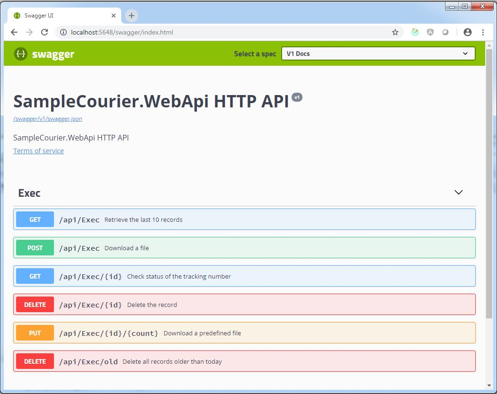

# SampleCourierNetCore

This sample is based on the Sample-Courier - https://github.com/MassTransit/Sample-Courier

Adapted the project for ASP.NET core: WebApi, Swagger, MassTransit, RabitMq, Automatonymous, DependencyInjection, EntityFrameworkCore and Serilog

Courier is MassTransit's routing-slip implementation, which makes it possible to orchestrate distributed services into a business transaction. 
This sample demonstrates how to create and execute a routing slip, record routing slip events, and track transaction state using Automatonymous.

A postman test collection can be found in the postman folder.

**WebApi console output:**

**TrackingService console output**:

**ProcessingService console output**:

**Web API help with Swagger**:

